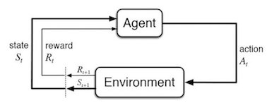

# CS330 Posterior Goal Sampling for Hierarchical Reinforcement Learning

   

Original Github code : [Deep Reinforcement Learning Algorithms with PyTorch](https://github.com/p-christ/Deep-Reinforcement-Learning-Algorithms-with-PyTorch).

This repository contains PyTorch implementations of deep reinforcement learning algorithms and environments. 

### Usage ###
The repository's high-level structure is:
 
    ├── agents                    
        ├── DQN_agents         
        ├── actor_critic_agents   
        ├── hierarchical_agents
        └── policy_gradient_agents
    ├── environments   
    ├── exploration_strategies
    ├── results             
        └── data_and_graphs        
    ├── tests
    ├── utilities             
        └── data structures     
        
## **Algorithms Implemented**  
*Hierarchical-DQN (h-DQN)* <sub><sup> ([Kulkarni et al. 2016](https://arxiv.org/pdf/1604.06057.pdf)) </sup></sub>
## **Environments Implemented**
*Long Corridor Game* <sub><sup> (as described in [Kulkarni et al. 2016](https://arxiv.org/pdf/1604.06057.pdf)) </sup></sub>

## **Modifications**
We are working on the h-DQN algorithm and provided a modified version that includes an Ensemble DQN Hierarchical RL for efficient high-level policy learning. The code is present in agents/hierarchical_agents/bh_agents.py.

We also included a new function pick_actions2() in agents/DQN_agents/DQN.py that allows goal sampling among all Q heads functions.

## **Execution**

```commandline
python results/Long_Corridor.py
``` 
